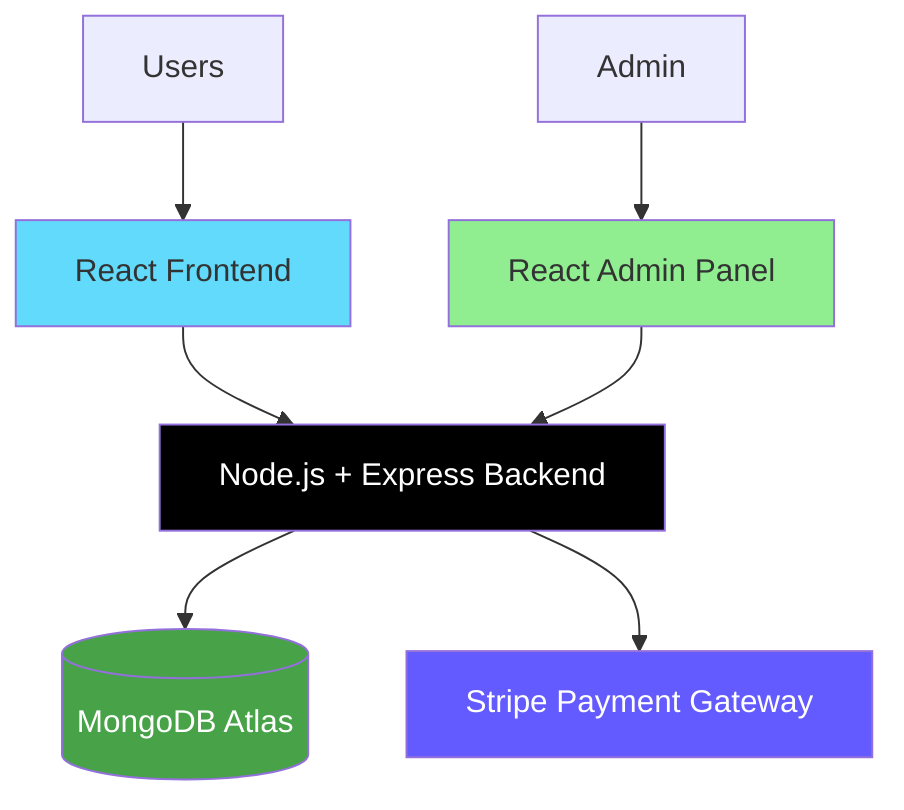
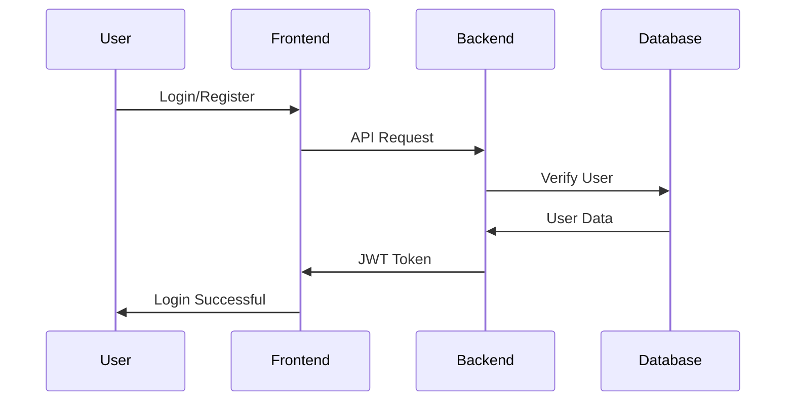

# Food Fleet - Full Stack Food Delivery Platform

Food Fleet is a modern full-stack food delivery web application built using the MERN stack. The platform allows users to browse food items, add products to cart, place orders online, and securely complete payments using Stripe. It also includes a dedicated admin dashboard for managing food items and customer orders.

---

# 🚀 Features

## 🍔 User Features

- Browse food items by categories
- Responsive and modern UI
- Add/remove items from cart
- User authentication and authorization
- Secure online payments with Stripe
- Place and track food orders
- Dynamic cart total calculation
- Mobile-friendly design

---

## 🛠️ Admin Features

- Add new food items
- Upload food images
- Remove food products
- Manage customer orders
- Update delivery status
- Admin dashboard interface

---

## 🔐 Authentication Features

- JWT-based authentication
- Secure password handling
- Protected routes
- Persistent login sessions

---

# 🛠️ Tech Stack

## Frontend

- React.js
- Vite
- React Router DOM
- Axios
- Context API
- CSS

---

## Backend

- Node.js
- Express.js
- MongoDB
- Mongoose
- JWT Authentication
- bcrypt
- Multer
- Stripe Payment Gateway

---

## Deployment

- Frontend → Vercel
- Admin Panel → Vercel
- Backend → Render
- Database → MongoDB Atlas

---

# 🏗️ System Architecture



---

# 📁 Project Structure

```txt
FOOD-FLEET/
├── frontend/                 # User frontend application
├── backend/                  # Backend API server
├── admin/                    # Admin dashboard
├── README.md
```

---

# 📦 Frontend Structure

```txt
frontend/
├── public/
├── src/
│   ├── assets/
│   ├── components/
│   ├── context/
│   ├── pages/
│   ├── App.jsx
│   ├── main.jsx
│   └── index.css
├── package.json
└── vite.config.js
```

---

# ⚙️ Backend Structure

```txt
backend/
├── config/
├── controllers/
├── middleware/
├── models/
├── routes/
├── uploads/
├── server.js
├── package.json
└── README.md
```

---

# 🖥️ Admin Panel Structure

```txt
admin/
├── public/
├── src/
│   ├── assets/
│   ├── components/
│   ├── pages/
│   ├── App.jsx
│   ├── main.jsx
│   └── index.css
├── package.json
└── README.md
```

---

# 🔥 Key Features

## 🛒 Cart Management

- Add items to cart
- Remove items from cart
- Dynamic quantity updates
- Real-time total calculation

---

## 💳 Stripe Payment Integration

Food Fleet integrates Stripe payment gateway for secure online payments.

### Payment Flow

1. User places order
2. Backend creates Stripe session
3. User completes payment
4. Payment verification performed
5. Order stored in MongoDB

---

## 📦 Order Management

### User Side

- Place orders
- View order history
- Track order status

### Admin Side

- View all orders
- Update delivery status
- Manage order flow

---

# 🔐 Authentication Flow



---

# 🌐 API Endpoints

## User Routes

| Method | Endpoint | Description |
|---|---|---|
| POST | `/api/user/register` | Register user |
| POST | `/api/user/login` | Login user |

---

## Food Routes

| Method | Endpoint | Description |
|---|---|---|
| GET | `/api/food/list` | Get food items |
| POST | `/api/food/add` | Add food item |
| POST | `/api/food/remove` | Remove food item |

---

## Cart Routes

| Method | Endpoint | Description |
|---|---|---|
| POST | `/api/cart/add` | Add to cart |
| POST | `/api/cart/remove` | Remove from cart |
| POST | `/api/cart/get` | Get cart data |

---

## Order Routes

| Method | Endpoint | Description |
|---|---|---|
| POST | `/api/order/place` | Place order |
| POST | `/api/order/verify` | Verify payment |
| POST | `/api/order/userorders` | Get user orders |
| GET | `/api/order/list` | Get all orders |
| POST | `/api/order/status` | Update order status |

---

# 🚀 Getting Started

## Prerequisites

- Node.js 18+
- npm
- MongoDB Atlas account
- Stripe account

---

# ⚡ Installation

## Clone Repository

```bash
git clone https://github.com/yourusername/food-fleet.git
```

---

## Install Frontend Dependencies

```bash
cd frontend
npm install
```

---

## Install Backend Dependencies

```bash
cd backend
npm install
```

---

## Install Admin Dependencies

```bash
cd admin
npm install
```

---

# 🔑 Environment Variables

## Backend `.env`

```env
PORT=4000
MONGO_URI=your_mongodb_connection_url
JWT_SECRET=your_secret_key
STRIPE_SECRET_KEY=your_stripe_secret_key
```

---

## Frontend `.env`

```env
VITE_API_URL=https://your-backend-url.onrender.com
```

---

## Admin `.env`

```env
VITE_API_URL=https://your-backend-url.onrender.com
```

---

# ▶️ Running the Project

## Start Backend

```bash
cd backend
npm run server
```

Backend runs on:

```txt
http://localhost:4000
```

---

## Start Frontend

```bash
cd frontend
npm run dev
```

Frontend runs on:

```txt
http://localhost:5173
```

---

## Start Admin Panel

```bash
cd admin
npm run dev
```

Admin panel runs on:

```txt
http://localhost:5174
```

---

# 🚢 Deployment

## Backend Deployment

Deploy backend on:

- Render

---

## Frontend Deployment

Deploy frontend on:

- Vercel

---

## Admin Deployment

Deploy admin panel on:

- Vercel

---

# 🔮 Future Improvements

- Real-time order tracking
- AI-based food recommendations
- Push notifications
- Email notifications
- User profile management
- Dark mode support
- Admin analytics dashboard

---

# 🐛 Troubleshooting

## MongoDB Connection Issues

- Verify MongoDB Atlas URL
- Check network access
- Verify `.env` variables

---

## Stripe Errors

- Verify Stripe secret key
- Verify frontend/backend URLs
- Check payment session creation

---

## CORS Errors

Ensure backend CORS configuration allows frontend and admin URLs.

---

# 📄 License

This project is developed for educational and portfolio purposes.

---

# 👨‍💻 Author

Developed using the MERN Stack for learning, portfolio, and placement preparation.